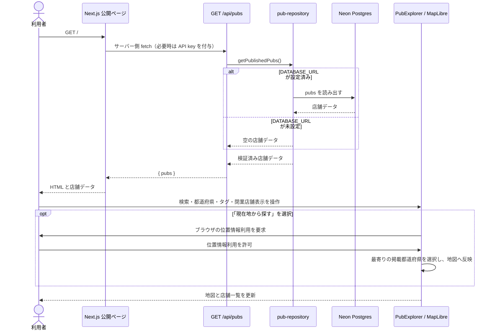
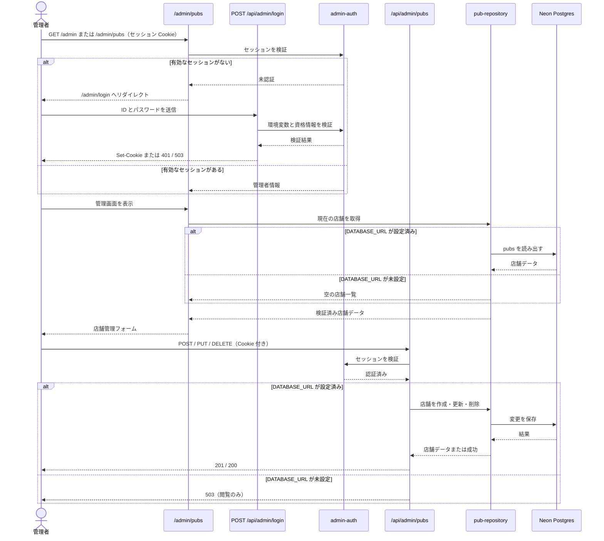
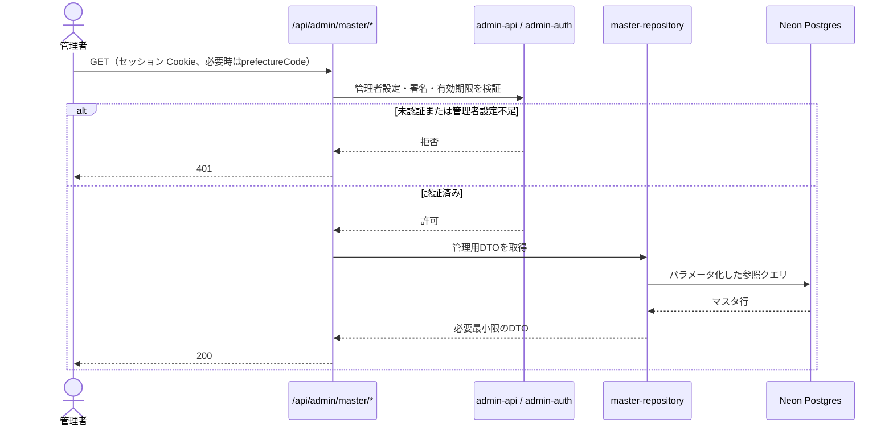

# シーケンス図

## 公開画面で店舗を表示する

VercelのPreview Deployment Protectionが公開APIのサーバー側fetchをSSOへリダイレクトした場合、公開ページは静的データを複製せず店舗0件で表示します。実データを表示するにはSSO回避用の設定とDATABASE_URLを構成します。WebGLを初期化できないブラウザでは、地図の代わりに店舗一覧を案内します。

## 管理者が店舗を追加・更新・削除する

管理 API のリクエストとレスポンス、HTTP ステータスの詳細は[API 方針](../specs/api.md)を参照してください。

## 管理画面が参照マスタを取得する

