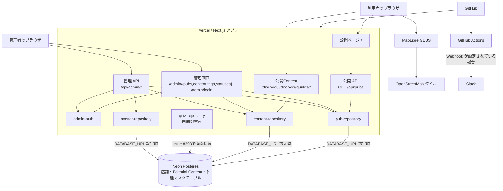

# システム構成

## 概要

Irish Pub Map は、Vercel 上の Next.js アプリとして動作します。公開画面はサーバー側で店舗データを取得し、ブラウザでは MapLibre GL JS により地図と店舗一覧を表示します。トップページ `/` はHeader / Map workspace / compact FooterのViewport Shellとして構成し、Privacyや管理画面とはレイアウト境界を分けます。管理画面は Cookie ベースの管理者セッションで保護し、Neon Postgres が設定されている場合に店舗データを永続化します。

## データの扱い

- `DATABASE_URL` が設定された環境では、`pub-repository` がNeonの店舗・マスタテーブルを読み書きします。未設定時は公開APIと画面が空の店舗一覧を返します。
- 公開Guideは`content-repository`がNeonのPublished Contentだけを取得し、安全なMarkdown Rendererへ渡します。Repository内MDX、Static Loader、MDX fallbackは使用しません。
- `quiz-repository`は公開Quizと管理QuizのNeonアクセス、回答前DTO、採点、日次選択を分離して提供します。Issue #393の画面切替までは既存画面から呼び出さず、静的Quizへのfallbackも行いません。
- 店舗テーブルが空の場合も自動投入は行わず、管理画面またはNeonインポート手順による明示的な投入を必要とします。市区町村コードは `municipality_codes` と結合して解決します。
- API とリポジトリ層は、共有パッケージの `asPubs` で読み出した店舗データを検証します。型の詳細は[店舗データ仕様](../specs/data.md)を参照してください。
- 現在地は利用目的を確認した明示操作後にだけ取得し、生の座標はブラウザ内でだけ保持します。アプリのAPIやDBへ送信・保存しません。ただし、現在地周辺を描画するOpenStreetMapタイル要求から、おおよその閲覧地域を送信先が推測できる可能性があります。
- Web AnalyticsとSpeed Insightsを利用し、利用状況と実利用環境の性能を把握しています。ホスティングと外部送信の詳細は[外部送信・プライバシー実態整理](../operations/privacy-and-external-transmission.md)を参照してください。

## 主要な境界

| 境界                 | 責務                                                                    |
| -------------------- | ----------------------------------------------------------------------- |
| ブラウザ             | 検索・絞り込み、位置情報の取得、地図描画、管理画面の操作                |
| Next.js ページ / API | 公開画面のデータ取得、HTTP API、管理画面へのアクセス制御                |
| `pub-repository`     | Neonの初期化、店舗データの CRUD                                         |
| `content-repository` | 公開Contentと管理Contentを分離し、日英Markdownと公開状態をNeonで管理    |
| `quiz-repository`    | 公開前DTO・採点・管理CRUDを分離し、QuizのNeonアクセスを集約             |
| `master-repository`  | 都道府県、市区町村、タグ、営業ステータスを管理用DTOへ変換して参照       |
| `admin-auth`         | 認証情報の検証、署名付き管理者セッション Cookie の発行・検証            |
| GitHub Actions       | 追跡済みファイルの機密情報検査、Lint、テスト、ビルド、任意の Slack 通知 |

代表的な処理の時系列は[シーケンス図](sequences.md)を参照してください。
