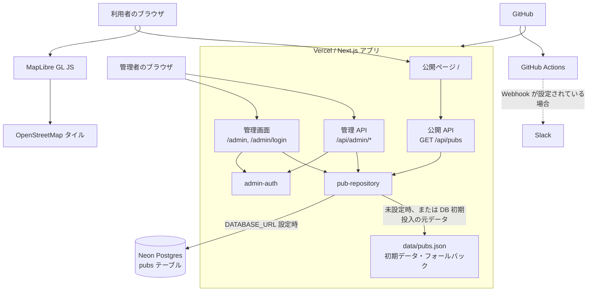

# システム構成

## 概要

Irish Pub Map は、Vercel 上の Next.js アプリとして動作します。公開画面はサーバー側で店舗データを取得し、ブラウザでは MapLibre GL JS により地図と店舗一覧を表示します。管理画面は Cookie ベースの管理者セッションで保護し、Neon Postgres が設定されている場合に店舗データを永続化します。

## データの扱い

- `data/pubs.json` は検証済みの初期データであり、`DATABASE_URL` が未設定の開発環境・公開 API のフォールバックにも使います。
- `DATABASE_URL` が設定されている場合、`pub-repository` は Neon の `pubs` テーブルを読み書きします。テーブルが空の場合は `data/pubs.json` の内容を初期投入します。
- API とリポジトリ層は、共有パッケージの `asPubs` で読み出した店舗データを検証します。型の詳細は[店舗データ仕様](../specs/data.md)を参照してください。

## 主要な境界

| 境界                 | 責務                                                                    |
| -------------------- | ----------------------------------------------------------------------- |
| ブラウザ             | 検索・絞り込み、位置情報の取得、地図描画、管理画面の操作                |
| Next.js ページ / API | 公開画面のデータ取得、HTTP API、管理画面へのアクセス制御                |
| `pub-repository`     | JSON フォールバック、Neon の初期化、店舗データの CRUD                   |
| `admin-auth`         | 認証情報の検証、署名付き管理者セッション Cookie の発行・検証            |
| GitHub Actions       | 追跡済みファイルの機密情報検査、Lint、テスト、ビルド、任意の Slack 通知 |

代表的な処理の時系列は[シーケンス図](sequences.md)を参照してください。
