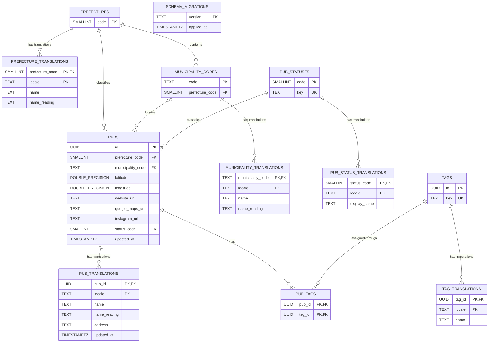

# データベース定義書

## 概要

Irish Pub Mapの永続化先はNeon Postgresです。`DATABASE_URL` が設定された環境では、`apps/web/app/lib/pub-repository.ts` が正規化済みの店舗・マスタ・翻訳・タグ関係テーブルを読み書きします。未設定時は公開APIと管理画面が空の店舗一覧を返し、更新操作は利用できません。

現行スキーマの根拠は、`db/migrations/001`〜`007`を順に適用した最終状態と `apps/web/app/lib/pub-repository.ts` です。カラム・制約・インデックスの詳細は[テーブル・カラム定義](database-columns.md)を参照してください。

## テーブル

| テーブル                    | 用途                                                           |
| --------------------------- | -------------------------------------------------------------- |
| `pubs`                      | 言語非依存の店舗属性、都道府県・市区町村・営業状況コードを保存 |
| `pub_translations`          | 店舗名・読み・住所をロケール別に保存                           |
| `prefectures`               | JIS都道府県コードを保存                                        |
| `prefecture_translations`   | 都道府県表示名・読みをロケール別に保存                         |
| `municipality_codes`        | 6桁の市区町村コードと所属都道府県を保存                        |
| `municipality_translations` | 市区町村表示名・読みをロケール別に保存                         |
| `pub_statuses`              | 営業状況コードと内部キーを保存                                 |
| `pub_status_translations`   | 営業状況表示名をロケール別に保存                               |
| `tags`                      | タグUUIDと正規化済み内部キーを保存                             |
| `tag_translations`          | タグ表示名をロケール別に保存                                   |
| `pub_tags`                  | 店舗とタグの多対多関係を保存                                   |
| `schema_migrations`         | 適用済みのスキーマMigrationを記録                              |

管理者ユーザーやセッションを保存するテーブルはありません。認証情報は環境変数、ログイン後のセッションは署名付きHttpOnly Cookieで管理します。

## ER図

翻訳テーブルは親IDと `locale` の複合主キーを持ちます。`prefecture_translations` と `tag_translations` は、同じロケール内で表示名が重複しないよう `UNIQUE (locale, name)` も持ちます。

`pubs.municipality_code` はDB上ではNULLを許可しますが、Migration 006・007は既存店舗の解決漏れがないことを検証し、Repositoryの追加・更新処理も日本語の市区町村表示名から一意にコードを解決できない入力を拒否します。

## 翻訳の選択

Repositoryは要求ロケールの翻訳を優先し、存在しない場合は日本語（`ja`）へフォールバックします。対象は店舗、都道府県、市区町村、営業状況、タグです。店舗の緯度経度、URL、コード、タグ関係など言語に依存しない値は親テーブルに保持します。

## 読み書き

| 操作     | 実装                      | 整合性の扱い                                                                |
| -------- | ------------------------- | --------------------------------------------------------------------------- |
| 取得     | `getPubs`                 | コードと翻訳を選択ロケールの共有 `Pub` 型へ変換し、タグを配列へ集約して検証 |
| 追加     | `createPub`               | UUIDを発行し、言語非依存属性、日本語店舗翻訳、タグ関係を保存                |
| 更新     | `updatePub`               | UUIDを維持し、言語非依存属性、日本語店舗翻訳、タグ関係を更新                |
| 削除     | `deletePub`               | 店舗を削除し、店舗翻訳と `pub_tags` は外部キーでカスケード削除              |
| 一括投入 | `scripts/import-pubs.mjs` | 日本語の市区町村をコードへ解決し、新規UUIDの店舗・翻訳・タグ関係だけを追加  |

店舗またはタグの削除時は、対応する翻訳と `pub_tags` が `ON DELETE CASCADE` で削除されます。都道府県・市区町村・営業状況を参照する店舗にはカスケード削除を設定していません。

## 関連ドキュメント

- [テーブル・カラム定義](database-columns.md)
- [正規化方針](database-normalization.md)
- [店舗データ仕様](data.md)
- [タグの正規化仕様](tag-normalization.md)
- [店舗テーブル移行手順](../operations/database-migration.md)
- [API 方針](api.md)
- [システム構成](../architecture/system-overview.md)
