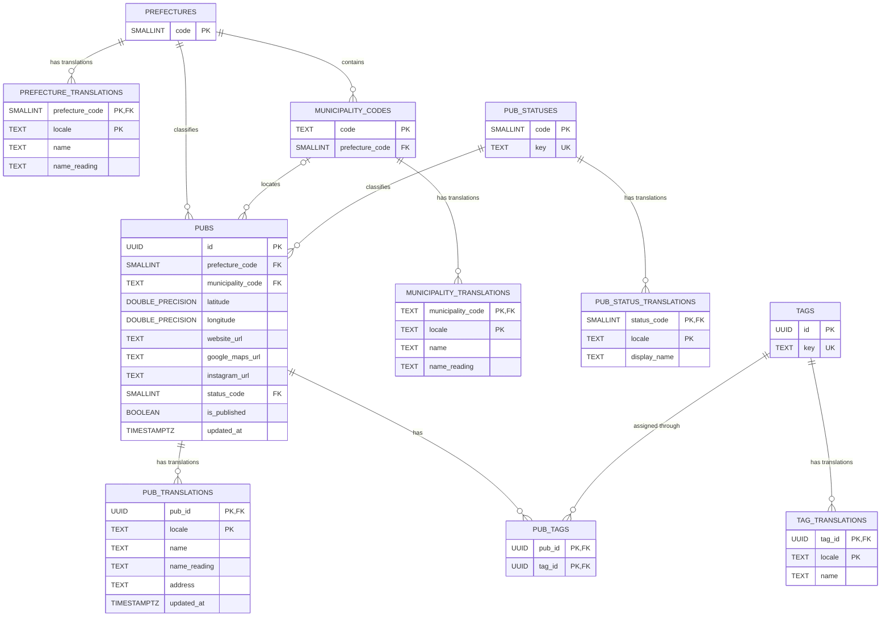

# データベース定義書

## 概要

Irish Pub Mapの永続化先はNeon Postgresです。`DATABASE_URL` が設定された環境では、`apps/web/app/lib/pub-repository.ts` が正規化済みの店舗・マスタ・翻訳・タグ関係テーブルを読み書きします。未設定時は公開APIと管理画面が空の店舗一覧を返し、更新操作は利用できません。

現行スキーマは、Issue #262で確認し、Issue #272で再確認したNeon上の実スキーマを基準とします。`apps/web/app/lib/pub-repository.ts` など現在のアプリケーション実装とも照合しています。`db/migrations` は設計経緯を確認するための補助資料であり、現行スキーマの根拠にはしません。カラム・制約・インデックスの詳細は[テーブル・カラム定義](database-columns.md)を参照してください。

Issue #273のマイグレーション008で `pubs.is_published` を追加し、Issue #278では下書き用NULL制約を定義するマイグレーション009を追加しました。実DBへの適用状況はアプリケーション実装と区別し、[デプロイ手順](../setup/deployment.md#管理画面と-neon-postgres)に従って009の適用・検証後にアプリケーションをデプロイします。管理用DTOとtransaction保存を含む保存・公開条件は[管理店舗の下書き・公開設計](admin-pub-lifecycle.md)を参照してください。

## テーブル

| テーブル                    | 用途                                                           |
| --------------------------- | -------------------------------------------------------------- |
| `pubs`                      | 言語非依存の店舗属性、都道府県・市区町村・営業状況コードを保存 |
| `pub_translations`          | 店舗名・読み・住所をロケール別に保存                           |
| `prefectures`               | JIS都道府県コードを保存                                        |
| `prefecture_translations`   | 都道府県表示名・読みをロケール別に保存                         |
| `municipality_codes`        | 6桁の市区町村コードと所属都道府県を保存                        |
| `municipality_translations` | 市区町村表示名・読みをロケール別に保存                         |
| `pub_statuses`              | 営業状況コードと内部キーを保存                                 |
| `pub_status_translations`   | 営業状況表示名をロケール別に保存                               |
| `tags`                      | タグUUIDと正規化済み内部キーを保存                             |
| `tag_translations`          | タグ表示名をロケール別に保存                                   |
| `pub_tags`                  | 店舗とタグの多対多関係を保存                                   |

管理者ユーザーやセッションを保存するテーブルはありません。認証情報は環境変数、ログイン後のセッションは署名付きHttpOnly Cookieで管理します。

## ER図

翻訳テーブルは親IDと `locale` の複合主キーを持ちます。`prefecture_translations` と `tag_translations` は、同じロケール内で表示名が重複しないよう `UNIQUE (locale, name)` も持ちます。

`pubs` の所在地、座標、営業状態と `pub_translations.address` は下書きではNULLを許可します。管理APIは市区町村コードが選択した都道府県に所属することと、各参照マスタに日本語表示名があることを保存前に検証します。

## 翻訳の選択

Repositoryは要求ロケールの翻訳を優先し、存在しない場合は共通locale定義の既定localeへフォールバックします。対象は店舗、都道府県、市区町村、営業状況、タグです。店舗の緯度経度、URL、コード、タグ関係など言語に依存しない値は親テーブルに保持します。

## 読み書き

| 操作 | 実装 | 整合性の扱い |
| --- | --- | --- |
| 公開取得 | `getPublishedPubs` | SQLで公開中だけに絞り、選択ロケールの共有 `Pub` 型へ変換して検証 |
| 管理一覧 | `getAdminPubPage` | 公開・非公開とNULLを含む下書きを検索・ページング済み一覧DTOで返す |
| 管理詳細 | `getAdminPub` | 日英翻訳、コード、タグID、公開状態を含む `AdminPub` を返す |
| 追加 | `createAdminPub` | 店舗本体、日英翻訳、既存タグ関係を単一transactionで保存し、常に非公開で作成 |
| 更新 | `updateAdminPub` | 公開状態を維持して全体更新し、公開済みの場合はPublish Validationを適用 |
| 削除 | `deleteAdminPub` | 店舗を削除し、店舗翻訳と `pub_tags` は外部キーでカスケード削除 |
| 一括投入 | `scripts/import-pubs.mjs` | 日本語の市区町村をコードへ解決し、新規UUIDの非公開店舗・翻訳・タグ関係だけを追加 |
| タグ管理取得 | `getAdminTags` | サポートlocaleの翻訳と `pub_tags` の重複を除いた使用店舗数を取得 |
| タグ管理追加 | `createAdminTag` | タグ本体と入力された各localeの翻訳を単一transactionで追加 |
| タグ管理更新 | `updateAdminTag` | keyを維持し、localeごとの翻訳を単一transactionでUPSERTまたは削除 |
| タグ管理削除 | `deleteAdminTag` | タグ行をロックし、`pub_tags` が0件の場合だけ条件付き削除 |

マイグレーション008は適用前に既存店舗が公開条件を満たすか検査し、成功した場合だけ既存店舗を公開状態へ移行します。マイグレーション009は既存値を変更せず下書き対象カラムのNOT NULLを外し、公開中店舗に欠損が生じていないことを検証SQLで確認します。どちらも適用履歴を `schema_migrations` に記録します。

店舗またはタグの削除時は、対応する翻訳と `pub_tags` が `ON DELETE CASCADE` で削除されます。ただし管理タグ機能は使用中タグのDELETE自体をtransaction内で拒否し、店舗関連や店舗を変更しません。都道府県・市区町村・営業状況を参照する店舗にはカスケード削除を設定していません。

## 関連ドキュメント

- [テーブル・カラム定義](database-columns.md)
- [正規化方針](database-normalization.md)
- [店舗データ仕様](data.md)
- [タグの正規化仕様](tag-normalization.md)
- [管理タグ仕様](tag-management.md)
- [API 方針](api.md)
- [管理店舗の下書き・公開設計](admin-pub-lifecycle.md)
- [システム構成](../architecture/system-overview.md)
