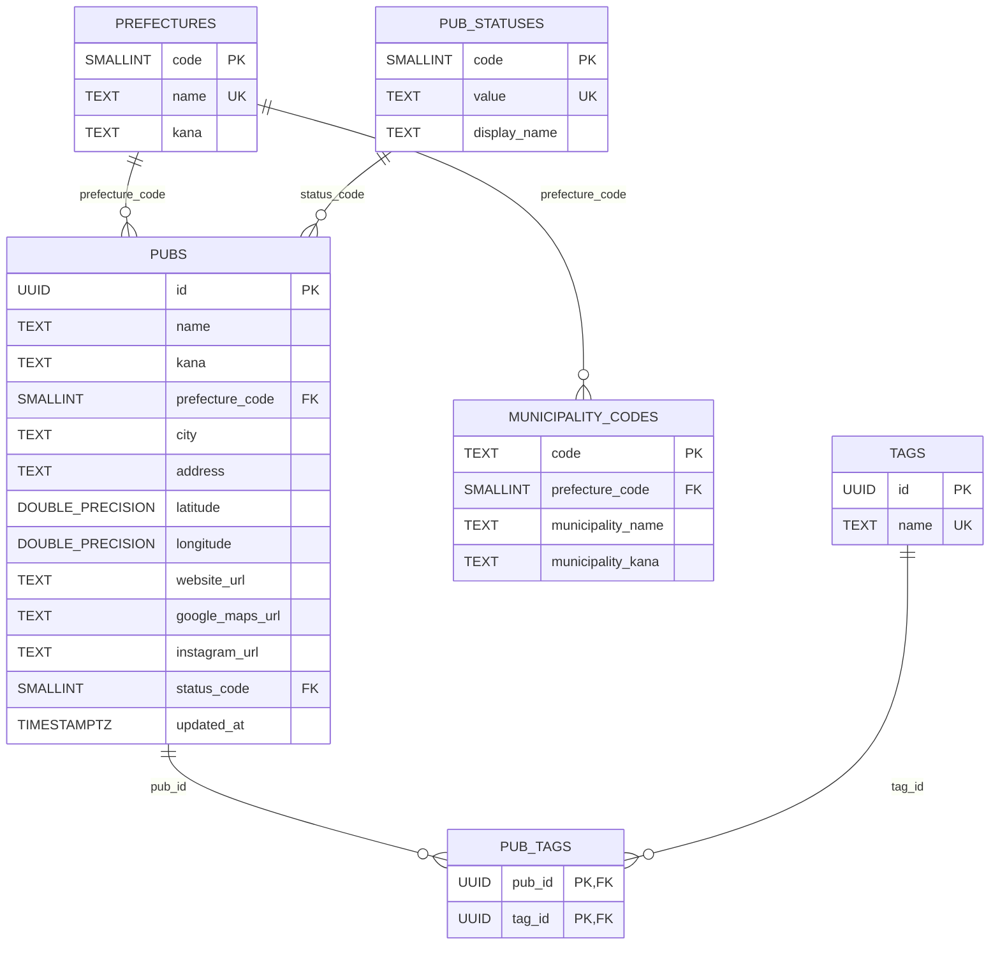

# データベース定義書

## 概要

Irish Pub Mapの永続化先はNeon Postgresです。`DATABASE_URL` が設定された環境では、`apps/web/app/lib/pub-repository.ts` が正規化済みの店舗・マスタ・タグ関係テーブルを読み書きします。未設定時は公開APIと管理画面が空の店舗一覧を返し、更新操作は利用できません。

現行スキーマの根拠は、アプリのリポジトリ層と `db/migrations/002_normalize_pub_metadata_up.sql`、`003_municipality_codes_up.sql`、`004_normalize_pub_tags_up.sql`、`005_normalize_tag_names_up.sql` です。`pubs` の各カラムは[店舗テーブル定義](database-columns.md)、既存DBの変更手順は[店舗テーブル移行手順](../operations/database-migration.md)を参照してください。

## テーブル

| テーブル             | 用途                                                 |
| -------------------- | ---------------------------------------------------- |
| `pubs`               | 店舗の基本情報、都道府県コード、営業状況コードを保存 |
| `prefectures`        | JIS都道府県コード、表示名、カナを保存                |
| `pub_statuses`       | 営業状況コード、外部値、表示名を保存                 |
| `municipality_codes` | 6桁の市区町村コード、市区町村名・カナを保存          |
| `tags`               | UUIDと正規化済みタグ名を保存                         |
| `pub_tags`           | 店舗とタグの多対多関係を保存                         |

管理者ユーザーやセッションを保存するテーブルはありません。認証情報は環境変数、ログイン後のセッションは署名付きHttpOnly Cookieで管理します。

## ER図

`pubs` と `municipality_codes` の間に外部キーはありません。公開APIの `municipalityCode` は、取得時に `prefecture_code` と `city` が市区町村マスタに一致した場合だけ付加します。

## 読み書き

| 操作     | 実装                      | 整合性の扱い                                                  |
| -------- | ------------------------- | ------------------------------------------------------------- |
| 取得     | `getPubs`                 | マスタを外部値へ戻し、タグを配列へ集約して共有 `Pub` 型で検証 |
| 追加     | `createPub`               | 入力を検証し、サーバー発行UUIDで店舗とタグ関係を追加          |
| 更新     | `updatePub`               | URLのUUIDを維持し、基本属性とタグ関係を更新                   |
| 削除     | `deletePub`               | 店舗を削除し、`pub_tags` は外部キーでカスケード削除           |
| 一括投入 | `scripts/import-pubs.mjs` | 新規UUIDだけを追加し、既存UUIDは更新せずスキップ              |

アプリは旧JSONB構成や途中まで適用されたスキーマを自動移行しません。`municipality_codes` が存在しない、または空の場合も読み出しを停止します。新規DBと既存DBの準備方法は[開発環境・セットアップ手順](../setup/development.md#店舗データの一括インポート)と[店舗テーブル移行手順](../operations/database-migration.md)を参照してください。

## 旧JSONB構成

移行前は `pubs(id TEXT, data JSONB, updated_at TIMESTAMPTZ)` に店舗データ全体を保存していました。現行アプリはこの構成を読み書きしません。履歴・バックアップテーブル・ID変換の詳細は001のup/down/verify SQLに集約し、現行定義とは分離します。

## 関連ドキュメント

- [店舗データ仕様](data.md)
- [店舗メタデータ正規化](database-normalization.md)
- [タグの正規化仕様](tag-normalization.md)
- [API 方針](api.md)
- [システム構成](../architecture/system-overview.md)
