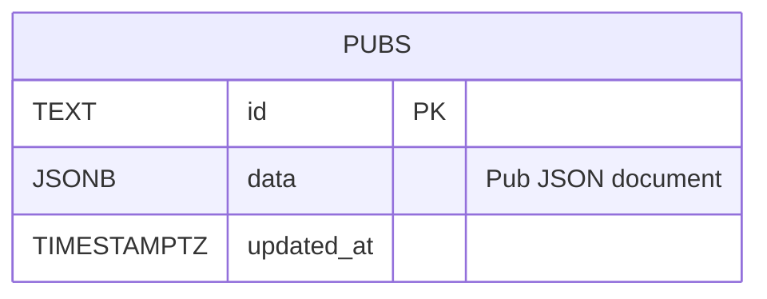

# データベース定義書

現行の店舗メタデータ正規化（都道府県・営業状況・市区町村コードの各マスタ、店舗タグ関係）は docs/specs/database-normalization.md と db/migrations/002_normalize_pub_metadata_up.sql、db/migrations/003_municipality_codes_up.sql を正とします。

## 概要

Irish Pub Map の永続化先は Neon Postgres です。`DATABASE_URL` が設定された環境では、`apps/web/app/lib/pub-repository.ts` が `pubs` テーブルを作成・読み書きします。

旧 JSONB 構成の履歴と互換情報は本書に残します。移行後の現行スキーマ、制約、インデックスは [項目別カラムの定義](database-columns.md) と [移行手順](../operations/database-migration.md) を正とします。

## テーブル一覧

| テーブル             | 用途                             |
| -------------------- | -------------------------------- |
| `pubs`               | Irish Pub の店舗情報を保存       |
| `prefectures`        | 都道府県コードと表示名を保存     |
| `pub_statuses`       | 営業状況コードと表示名を保存     |
| `municipality_codes` | 市区町村コードと名称・カナを保存 |
| `pub_tags`           | 店舗とタグの対応を保存           |

管理者ユーザーやセッションを保存するテーブルはありません。管理者認証情報は環境変数で管理し、ログイン後のセッションは署名付き HttpOnly Cookie で管理します。

## 移行前の `pubs` テーブル（履歴）

### DDL

```sql
CREATE TABLE IF NOT EXISTS pubs (
  id TEXT PRIMARY KEY,
  data JSONB NOT NULL,
  updated_at TIMESTAMPTZ NOT NULL DEFAULT NOW()
);
```

### カラム定義

| カラム       | PostgreSQL 型 | NULL | デフォルト | 制約・用途                                                   |
| ------------ | ------------- | ---- | ---------- | ------------------------------------------------------------ |
| `id`         | `TEXT`        | 不可 | なし       | 主キー。店舗を一意に識別する。`data.id` と同じ値を保存する。 |
| `data`       | `JSONB`       | 不可 | なし       | 共有 `Pub` 型の店舗データ全体を保存する。                    |
| `updated_at` | `TIMESTAMPTZ` | 不可 | `NOW()`    | 更新日時。`UPDATE` 時に `NOW()` で更新する。                 |

`id` による主キー制約以外のデータ内容の検証は、PostgreSQL の CHECK 制約ではなくアプリケーション層で行います。読み出し時と管理 API の入力時には `packages/shared/src/pub.ts` の `asPubs` を使って検証します。

### `data` JSONB の構造

`data` には次の `Pub` オブジェクトを 1 件分保存します。

| JSON キー       | JSON 型        | 必須 | 説明                                                         |
| --------------- | -------------- | ---- | ------------------------------------------------------------ |
| `id`            | string         | yes  | `pubs.id` と同じ店舗 ID                                      |
| `name`          | string         | yes  | 店舗名                                                       |
| `kana`          | string         | no   | 店舗名の読み（ひらがな）。かな検索に使用                     |
| `prefecture`    | string         | yes  | 都道府県                                                     |
| `city`          | string \| null | no   | 市区町村                                                     |
| `address`       | string         | yes  | 住所                                                         |
| `latitude`      | number         | yes  | 緯度（-90 以上 90 以下）                                     |
| `longitude`     | number         | yes  | 経度（-180 以上 180 以下）                                   |
| `websiteUrl`    | string \| null | no   | 公式サイト URL                                               |
| `googleMapsUrl` | string \| null | no   | Google Maps URL                                              |
| `instagramUrl`  | string \| null | no   | Instagram URL                                                |
| `tags`          | string[]       | yes  | 検索・絞り込み用タグ                                         |
| `status`        | string         | yes  | `open`、`temporarily_closed`、`closed`、`unknown` のいずれか |

### インデックス

明示的に作成するインデックスはありません。主キー `pubs_pkey` は `id` の一意性を保証するために PostgreSQL が自動作成します。

一覧取得では次の式で都道府県、店舗名の順に並べ替えますが、現行実装では対応する式インデックスを作成していません。

```sql
SELECT data
FROM pubs
ORDER BY data->>'prefecture', data->>'name';
```

### 操作と整合性

| 操作 | 実装 | 整合性の扱い |
| --- | --- | --- |
| 初期作成 | `ensureTable` | テーブルがなければ作成する。空テーブルの場合は `data/pubs.json` を `ON CONFLICT DO NOTHING` で初期投入する。 |
| 一括投入 | `scripts/import-pubs.mjs` | `id` が既存の場合はスキップし、新規 ID のみ追加する。 |
| 取得 | `getPubs` | JSONB の配列を `asPubs` で検証して返す。 |
| 追加 | `createPub` | 入力を検証し、サーバー発行 UUID を `id` に設定して追加する。 |
| 更新 | `updatePub` | URL の ID を維持して `data` と `updated_at` を更新する。 |
| 削除 | `deletePub` | `id` に一致する行を削除する。 |

## ER 図

現行スキーマは `pubs` と都道府県・営業状況・市区町村コード・タグの各マスタ／関係テーブルで構成します。



`data` JSONB 内のキーは、ER 図上の別テーブルや別カラムではありません。店舗の属性を JSON ドキュメントとしてまとめて保存しているため、上図では `data` という 1 カラムとして表現しています。

## 関連ドキュメント

- [店舗データ仕様](data.md)
- [API 方針](api.md)
- [システム構成](../architecture/system-overview.md)
- [開発環境と環境変数](../setup/development.md)
